# IKB42603 Cloud Computing Security Essentials — Lab 3
## Data Protection: Encryption & Key Management (Weeks 5–6)

## Course Info

| Field | Detail |
|---|---|
| Course | IKB42603 Cloud Computing Security Essentials |
| Institution | UniKL MIIT |
| Lecturer | Prof. Dr. Shahrulniza Musa |
| Student Name | NURSYAFINA BINTI RAMLI |
| Student ID | 52215124843 |
| Lab | Lab 3 — Data Protection: Encryption & Key Management |
| Environment | Kali Linux (Rolling 2026.2) on VMware Workstation |
| Tools Used | OpenSSL, Docker, AWS CLI v2, LocalStack 3.0 (community) |

## Objective

To gain hands-on experience protecting cloud data through:
1. Symmetric (AES) and asymmetric (RSA) encryption of data at rest.
2. Encryption of data in transit using TLS.
3. Use of a cloud Key Management Service (KMS) and envelope encryption for scalable key management.
4. Per-tenant key isolation and cryptographic erasure for provable, permanent data deletion.
5. Verification of data integrity through hashing and a tamper-evident hash chain.

## Evidence Folder

All evidence screenshots are stored in the `Lab3/` folder of the submission repository.

| # | Filename | Task | Description |
|---|---|---|---|
| 1 | task1_aes_encrypt.png | Task 1 | AES-256 encryption — ciphertext unreadable |
| 2 | task1_aes_decrypt_match.png | Task 1 | AES-256 decryption — MATCH confirmation |
| 3 | task2_rsa_keygen.png | Task 2 | RSA 2048-bit key pair generated |
| 4 | task2_rsa_encrypt_decrypt.png | Task 2 | RSA public-key encrypt / private-key decrypt |
| 5 | task2_rsa_signature_verify.png | Task 2 | Digital signature — Verified OK |
| 6 | task3_tls_cert_gen.png | Task 3 | Self-signed TLS certificate generated |
| 7 | task3_tls_curl_output.png | Task 3 | curl -k over HTTPS — successful retrieval |
| 8 | task3_http_refused.png | Task 3 | Plain HTTP request rejected by HTTPS-only server |
| 9 | task4_kms_create_key_tenantA.png | Task 4 | KMS master key created (Tenant A) |
| 10 | task4_kms_encrypt_secret.png | Task 4 | Direct KMS encrypt of small secret |
| 11 | task5_generate_data_key.png | Task 5 | KMS generate-data-key output |
| 12 | task5_datakey_files_saved.png | Task 5 | Plaintext + wrapped data key saved from same call |
| 13 | task5_envelope_encrypt_local.png | Task 5 | Local AES encryption using plaintext data key |
| 14 | task5_plaintext_datakey_destroyed.png | Task 5 | Plaintext data key destroyed — only wrapped copy remains |
| 15 | task6_kms_create_key_tenantB.png | Task 6 | KMS master key created (Tenant B) |
| 16 | task6_before_decrypt_success.png | Task 6 | BEFORE — data key unwrap succeeds |
| 17 | task6_schedule_deletion_disable.png | Task 6 | Key scheduled for deletion (PendingDeletion state) |
| 18 | task6_after_decrypt_fail.png | Task 6 | AFTER — data key unwrap fails (KMSInvalidStateException) |
| 19 | task7_hash_tamper_detect.png | Task 7 | SHA-256 hash mismatch after tampering |
| 20 | task7_hash_chain.png | Task 7 | Tamper-evident SHA-256 hash chain |

---

## Session A — Encryption Fundamentals

### Task 1 — Symmetric Encryption (Data at Rest)

**Command:**
```bash
echo 'Patient: Ahmad, Diagnosis: confidential' > record.txt
openssl enc -aes-256-cbc -pbkdf2 -salt -in record.txt -out record.enc
cat record.enc
openssl enc -d -aes-256-cbc -pbkdf2 -in record.enc -out record.dec.txt
diff record.txt record.dec.txt && echo 'MATCH: decryption successful'
```

**Output:** `record.enc` produced unreadable ciphertext; decryption reproduced the original plaintext exactly, confirmed by `MATCH: decryption successful`.

**Result:** AES-256-CBC symmetric encryption and decryption verified successfully.

**Evidence:** 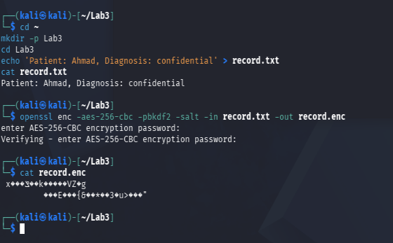 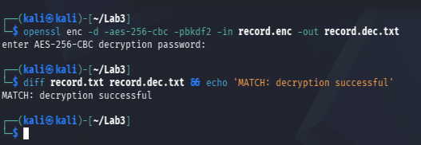

---

### Task 2 — Asymmetric Encryption & Digital Signatures

**Command:**
```bash
openssl genrsa -out private.pem 2048
openssl rsa -in private.pem -pubout -out public.pem
openssl pkeyutl -encrypt -pubin -inkey public.pem -in record.txt -out record.rsa
openssl pkeyutl -decrypt -inkey private.pem -in record.rsa -out record.rsa.txt
openssl dgst -sha256 -sign private.pem -out record.sig record.txt
openssl dgst -sha256 -verify public.pem -signature record.sig record.txt
```

**Output:** RSA 2048-bit key pair generated (`private.pem` 1704 bytes, permission `600`; `public.pem` 451 bytes). Data encrypted with the public key was correctly decrypted with the private key, reproducing the original text. Signature verification returned `Verified OK`.

**Result:** Asymmetric encryption and digital signature workflow verified successfully.

**Evidence:** 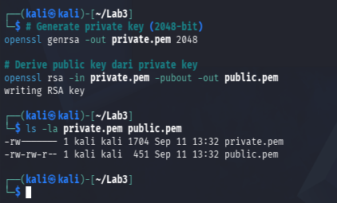 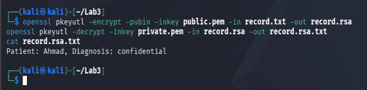 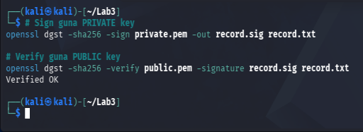

---

### Task 3 — Encryption in Transit (TLS)

**Command:**
```bash
openssl req -x509 -newkey rsa:2048 -keyout key.pem -out cert.pem -days 7 -nodes -subj '/CN=localhost'

cat > nginx-ssl.conf << 'EOF'
server {
    listen 443 ssl;
    server_name localhost;
    ssl_certificate     /etc/nginx/cert.pem;
    ssl_certificate_key /etc/nginx/key.pem;
    location / {
        root /usr/share/nginx/html;
    }
}
EOF

docker run --rm -d --name tls -p 8443:443 \
  -v $(pwd)/cert.pem:/etc/nginx/cert.pem \
  -v $(pwd)/key.pem:/etc/nginx/key.pem \
  -v $(pwd)/record.txt:/usr/share/nginx/html/record.txt \
  -v $(pwd)/nginx-ssl.conf:/etc/nginx/conf.d/default.conf \
  nginx

curl -k https://localhost:8443/record.txt
curl http://localhost:8443/record.txt
```

**Output:** `curl -k` over HTTPS successfully retrieved the record contents. A plain HTTP request to the same port was rejected with `400 Bad Request — The plain HTTP request was sent to an HTTPS port`.

**Result:** TLS in-transit encryption verified; the server was confirmed to enforce HTTPS-only access and reject unencrypted requests.

*Troubleshooting note:* The default nginx image did not automatically apply TLS despite the certificate files being mounted, since its default configuration only listens on port 80. A custom `nginx-ssl.conf` server block explicitly enabling `listen 443 ssl` was required to activate TLS termination — demonstrating that possessing a certificate does not by itself guarantee encryption is enforced; correct server configuration is equally essential.

**Evidence:**   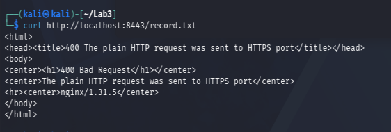

---

## Session B — Key Management, Envelope Encryption & Erasure

### Task 4 — Create and Use a KMS Master Key

**Command:**
```bash
EP='--endpoint-url=http://localhost:4566'
aws $EP kms create-key --description 'CCSE tenant-A master key'
KEY_A=98611d4a-2bd2-4d05-b79c-8517d0ec2123
aws $EP kms encrypt --key-id $KEY_A --plaintext "$(echo -n 'hello' | base64)" \
  --query CiphertextBlob --output text
```

**Output:** Master key created (`KeyId: 98611d4a-2bd2-4d05-b79c-8517d0ec2123`, state `Enabled`). Direct KMS encryption of a small secret returned a ciphertext blob.

**Result:** KMS master key creation and direct encrypt/decrypt operation verified.

**Evidence:** 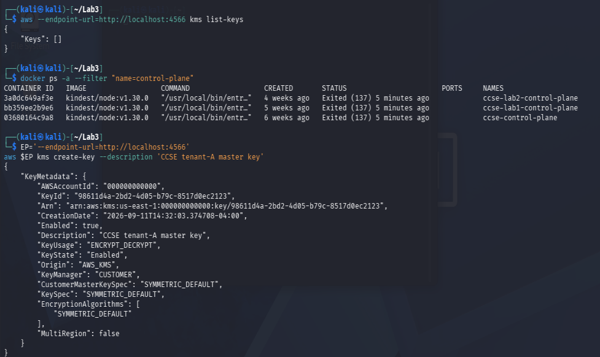 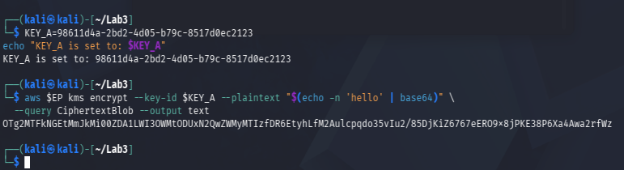

---

### Task 5 — Envelope Encryption

**Command:**
```bash
DK_OUTPUT=$(aws $EP kms generate-data-key --key-id $KEY_A --key-spec AES_256 \
  --query '[Plaintext,CiphertextBlob]' --output text)
echo "$DK_OUTPUT" | awk '{print $1}' > datakey.b64
echo "$DK_OUTPUT" | awk '{print $2}' > datakey.enc.b64

base64 -d datakey.b64 > datakey.bin
openssl enc -aes-256-cbc -pbkdf2 -in record.txt -out record.env.enc -pass file:./datakey.bin

rm datakey.bin datakey.b64
```

**Output:** A data key pair (plaintext + KMS-wrapped) was generated from a single API call. `record.txt` was encrypted locally using the plaintext data key, producing `record.env.enc`. The plaintext data key files were then deleted, leaving only the wrapped copy (`datakey.enc.b64`) on disk.

**Result:** Envelope encryption completed successfully; plaintext key material removed after use, in line with the data-minimization principle.

**Evidence:** 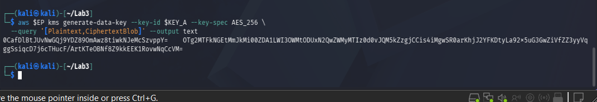 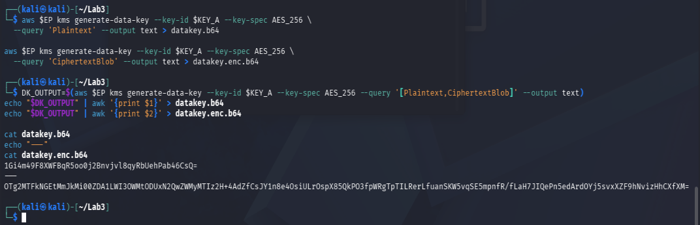 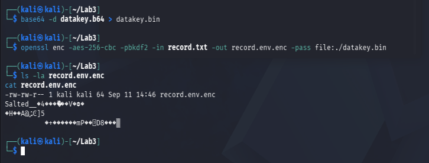 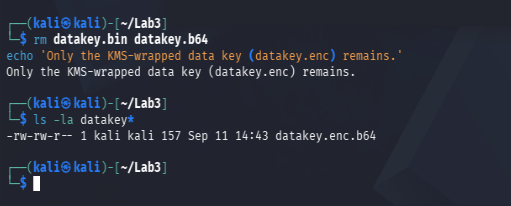

---

### Task 6 — Per-Tenant Keys & Cryptographic Erasure

**Command:**
```bash
aws $EP kms create-key --description 'CCSE tenant-B master key'
KEY_B=5b07a973-e8c1-43f8-8fe5-712b96f586b1

# BEFORE erasure
base64 -d datakey.enc.b64 > datakey.enc
aws $EP kms decrypt --ciphertext-blob fileb://datakey.enc --query 'Plaintext' --output text

# Erasure
aws $EP kms schedule-key-deletion --key-id $KEY_A --pending-window-in-days 7

# AFTER erasure
aws $EP kms decrypt --ciphertext-blob fileb://datakey.enc 2>&1 | head -5
```

**Output:**
- Tenant-B master key created (`KeyId: 5b07a973-e8c1-43f8-8fe5-712b96f586b1`), isolated from Tenant-A.
- **BEFORE:** decrypting the wrapped data key with Tenant-A's key succeeded, returning the original plaintext data key.
- Tenant-A's key was scheduled for deletion (`KeyState: PendingDeletion`, 7-day pending window).
- **AFTER:** the identical decrypt attempt failed with `KMSInvalidStateException: ... is pending deletion`.

**Result:** Per-tenant key isolation confirmed. Cryptographic erasure verified via before/after comparison — once the wrapping master key was disabled/scheduled for deletion, the protected data (`record.env.enc`) became permanently unrecoverable, even though the ciphertext itself still exists on disk.

**Evidence:** 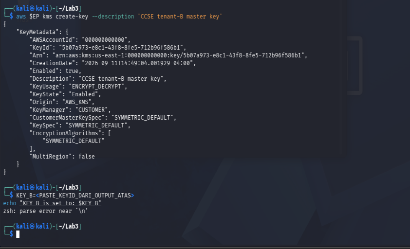 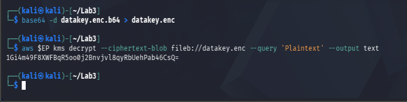 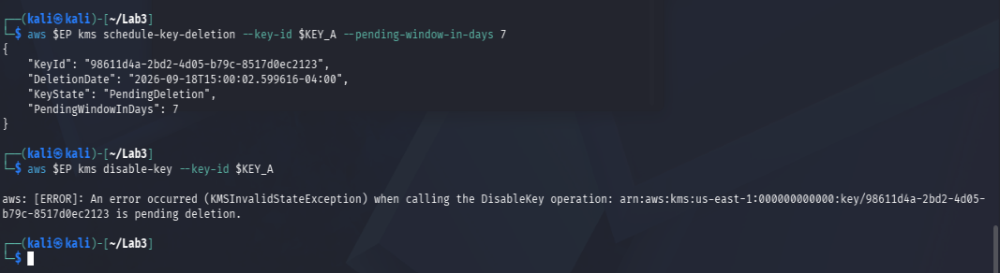 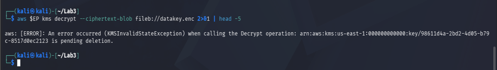

---

### Task 7 — Integrity & Tamper-Evidence

**Command:**
```bash
sha256sum record.txt
cp record.txt tampered.txt
echo 'x' >> tampered.txt
sha256sum record.txt tampered.txt

PREV=0
for line in 'login ok' 'file read' 'export data'; do
  PREV=$(echo -n "$PREV$line" | sha256sum | cut -d' ' -f1)
  echo "$line | $PREV"
done
```

**Output:** Appending a single character to a copy of `record.txt` produced a completely different SHA-256 hash. The hash-chain loop produced three chained hash entries, each incorporating the previous entry's hash.

**Result:** Integrity verification and tamper-evident logging demonstrated successfully.

**Evidence:** 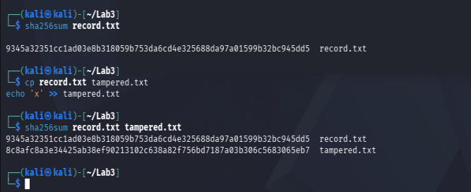 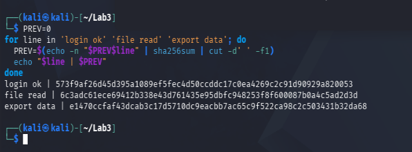

---

## Short-Answer Questions

**Q1. Compare symmetric and asymmetric encryption: speed, key distribution, and typical use.**

Symmetric encryption (e.g. AES-256, used in Task 1) uses a single shared key for both encryption and decryption. It is computationally fast and well-suited to encrypting large volumes of data, but it suffers from the key-distribution problem: the same secret key must somehow be shared with every party that needs to decrypt the data, and any exposure of that key during transfer or storage compromises all data protected by it. Asymmetric encryption (e.g. RSA, used in Task 2) uses a mathematically related key pair — a public key that can be freely distributed, and a private key that must remain secret. This solves the key-distribution problem since only the public key needs to be shared, but it is significantly slower and impractical for large data. In practice, cloud systems combine both: asymmetric encryption is typically used to securely exchange a symmetric key (as demonstrated conceptually in TLS, Task 3, and in envelope encryption, Task 5), after which the fast symmetric cipher handles the bulk data.

**Q2. Why is key management described as the weakest link, not the algorithm?**

Modern algorithms such as AES-256 and RSA-2048 are considered computationally secure against brute-force attack given current technology. The real risk lies in how the keys that operate these algorithms are generated, stored, distributed, rotated, and destroyed. If a key is exposed — left in a plaintext file, hardcoded in source code, or improperly shared — the strength of the underlying algorithm becomes irrelevant, since the attacker can decrypt data directly with the compromised key. This lab demonstrated the point directly in Task 5: the entire security of `record.env.enc` depended not on AES's mathematical strength, but on whether the plaintext data key was properly destroyed after use.

**Q3. Explain envelope encryption and why only the master key needs hardware-grade protection.**

Envelope encryption is a two-layer key hierarchy used to encrypt large data efficiently while keeping the most sensitive key material minimally exposed. A KMS-generated data key encrypts the actual data locally (fast, no size limitation from the KMS API), and that data key is itself "wrapped" (encrypted) by a master key held inside the KMS. The wrapped data key can then be stored alongside the encrypted data safely, since it is useless without the master key. Because the master key never leaves the KMS and is only ever used internally to wrap/unwrap small data keys, it is the single point that requires the highest level of protection (e.g. hardware security modules); the data keys and encrypted data, by contrast, can be freely stored and moved, since they are only meaningful in combination with the protected master key.

**Q4. How does cryptographic erasure achieve provable deletion where overwriting cannot (in the cloud)?**

In a cloud environment, the underlying physical storage is controlled entirely by the cloud provider, and data may exist across multiple replicas, snapshots, or backups that the customer has no direct means to locate or physically overwrite. Cryptographic erasure sidesteps this limitation entirely: instead of trying to erase every physical copy of the data, it destroys or disables the master key used to protect that data. As demonstrated in Task 6, once Tenant-A's master key was scheduled for deletion, the wrapped data key — and therefore the encrypted record `record.env.enc` — became permanently unreadable everywhere at once, regardless of how many copies exist, since the confidentiality of the data was always tied to the key, not to any particular storage location.

**Q5. How does a hash chain make a log tamper-evident?**

In a hash chain, each log entry's hash is computed from both the entry's own content and the hash of the previous entry, forming a linked sequence. If an attacker attempts to modify, delete, or reorder any entry in the log, the hash for that entry changes, which in turn breaks the chained hash of every subsequent entry that depends on it. As demonstrated in Task 7, this means a single altered entry causes a detectable ripple effect through the rest of the chain, making silent tampering with historical log records infeasible without it being immediately evident during verification — the same principle underlying tamper-evident audit trails and blockchain structures.

---

## Security Best-Practices Checklist

- [x] Data encrypted at rest (AES) and decryption verified.
- [x] Asymmetric keys used correctly (encrypt with public, sign with private).
- [x] Data protected in transit with TLS.
- [x] Envelope encryption used; plaintext data key not left on disk.
- [x] Per-tenant keys used; cryptographic erasure demonstrated.
- [x] Integrity verified with hashing / hash chain.

## Conclusion

This lab provided practical, end-to-end exposure to the core building blocks of cloud data protection. Session A established the cryptographic fundamentals — symmetric encryption for speed, asymmetric encryption and signatures for secure key exchange and authenticity, and TLS for protecting data while it moves across a network. Session B extended these fundamentals into how a real cloud KMS manages keys at scale: envelope encryption balances performance and security by combining a fast local cipher with a tightly-protected master key, per-tenant key isolation contains the impact of a single key's compromise, and cryptographic erasure demonstrated a uniquely cloud-native way to make data provably unrecoverable without needing physical control over storage media. Throughout the lab, the recurring lesson was that encryption algorithms themselves are rarely the weak point — the discipline of key management, from generation through to destruction, is what ultimately determines whether protected data stays protected.
