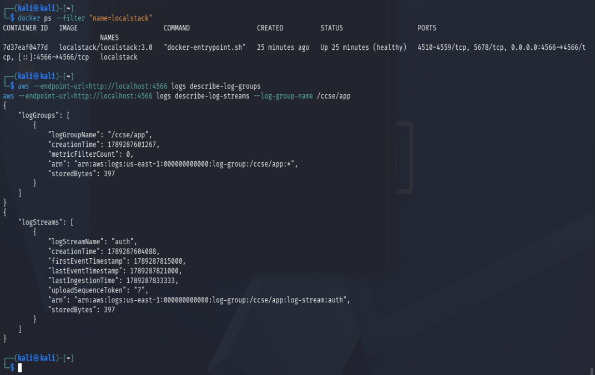
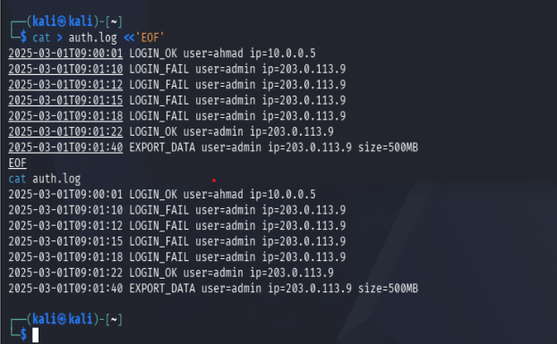
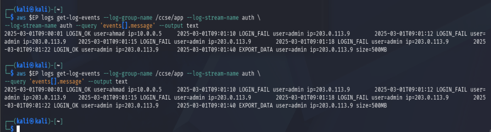
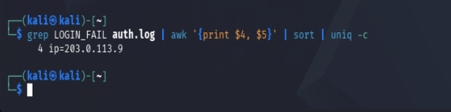
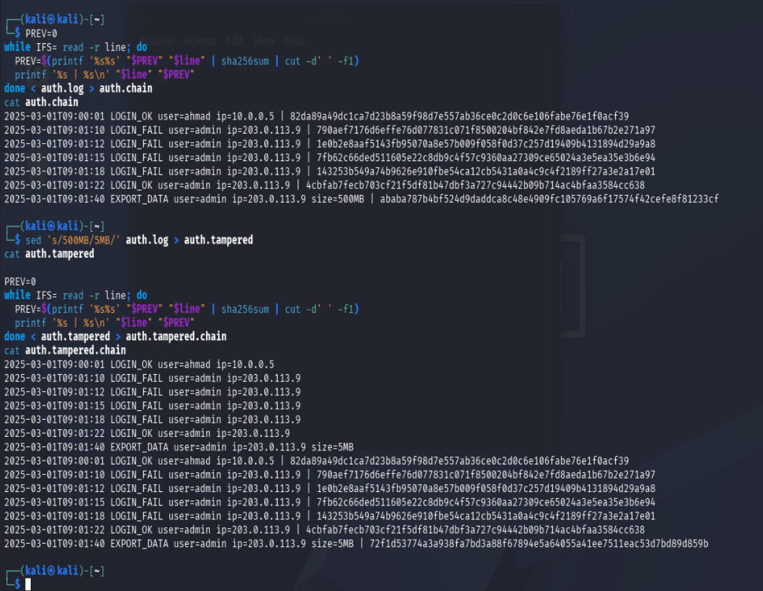
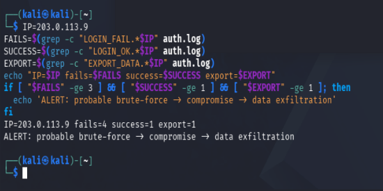
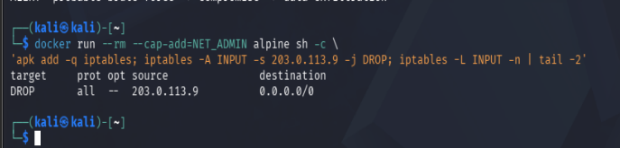
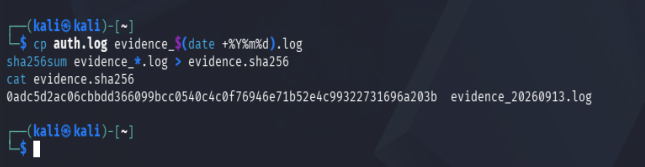
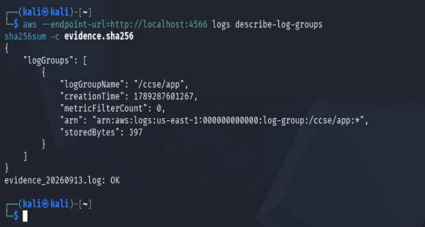

# IKB42603 Cloud Computing Security Essentials — Lab 5
## Monitoring, Logging & Incident Detection

## Course Info

| | |
|---|---|
| **Course** | IKB42603 Cloud Computing Security Essentials |
| **Lab** | Lab 5 — Monitoring, Logging & Incident Detection (Weeks 9–10) |
| **Student** | NURSYAFINA BINTI RAMLI (52215124843) |
| **Environment** | Kali Linux (Rolling 2026.2), zsh shell |
| **Tools** | Docker, AWS CLI v2, LocalStack 3.0 (community) |
| **Repository** | https://github.com/nurrsyafina/IKB42603-CLOUD-COMPUTING-SECURITY-ESSENTIALS |

## Objective

This lab demonstrates the full lifecycle of security monitoring: generating and centralising application logs, querying logs for security-relevant activity, building tamper-evident (hash-chained) logs, detecting an incident through event correlation, and executing an incident-response workflow (contain, collect evidence, document).

## Evidence Folder

| # | Filename | Task | Description |
|---|---|---|---|
| 1 | `task0_localstack_setup.png` | Setup | LocalStack container start + CloudWatch log group/stream creation |
| 2 | `task2_centralised_readback.png` | Task 2 | Log events read back from centralised store |
| 3 | `task3_failed_login_query.png` | Task 3 | Failed-login count grouped by IP |
| 4 | `task4_hashchain_full.png` | Task 4 | Original hash chain + tampered chain, showing final hash divergence |
| 5 | `task5_correlation_alert.png` | Task 5 | Correlation ALERT output |
| 6 | `task6a_containment_iptables.png` | Task 6 | iptables DROP rule applied |
| 7 | `task6b_evidence_collection.png` | Task 6 | Evidence copy + SHA-256 hash generated |
| 8 | `task6c_final_verification.png` | Verification | `describe-log-groups` + `sha256sum -c` check |

---

## Task-by-Task

### Setup — Start LocalStack

**Command**
```bash
docker run -d --name localstack -p 4566:4566 localstack/localstack:3.0
EP='--endpoint-url=http://localhost:4566'
aws $EP logs create-log-group --log-group-name /ccse/app
aws $EP logs create-log-stream --log-group-name /ccse/app --log-stream-name auth
```

**Output**
Container started successfully; `describe-log-groups` and `describe-log-streams` confirmed `/ccse/app` and stream `auth` exist.

**Result**
✅ LocalStack running, CloudWatch Logs log group and stream created.

**Evidence:** `task0_localstack_setup.png`



---

### Task 1 — Generate Application Logs

**Command**
```bash
cat > auth.log <<'EOF'
2025-03-01T09:00:01 LOGIN_OK user=ahmad ip=10.0.0.5
2025-03-01T09:01:10 LOGIN_FAIL user=admin ip=203.0.113.9
2025-03-01T09:01:12 LOGIN_FAIL user=admin ip=203.0.113.9
2025-03-01T09:01:15 LOGIN_FAIL user=admin ip=203.0.113.9
2025-03-01T09:01:18 LOGIN_FAIL user=admin ip=203.0.113.9
2025-03-01T09:01:22 LOGIN_OK user=admin ip=203.0.113.9
2025-03-01T09:01:40 EXPORT_DATA user=admin ip=203.0.113.9 size=500MB
EOF
cat auth.log
```

**Output**
7 lines written and confirmed via `cat auth.log`.

**Result**
✅ Simulated authentication log created, including a brute-force → success → export pattern.

**Evidence:** `task1_auth_log_generated.png`



---

### Task 2 — Centralise Logs (Ship to CloudWatch)

**Command**
```bash
TS=$(date +%s000)
while IFS= read -r line; do
  aws $EP logs put-log-events --log-group-name /ccse/app --log-stream-name auth \
  --log-events timestamp=$TS,message="$line" >/dev/null; TS=$((TS+1000));
done < auth.log

aws $EP logs get-log-events --log-group-name /ccse/app --log-stream-name auth \
--query 'events[].message' --output text
```

**Output**
All 7 log lines read back identically from the centralised CloudWatch (LocalStack) store.

**Result**
✅ Logs successfully shipped and verified from a store separate from the source file.

**Evidence:** `task2_centralised_readback.png`



---

### Task 3 — Query for Security-Relevant Activity

**Command**
```bash
grep LOGIN_FAIL auth.log | awk '{print $4, $5}' | sort | uniq -c
```

**Output**
```
4 ip=203.0.113.9
```

**Result**
✅ Query confirms 4 failed login attempts from a single IP — a brute-force indicator.

**Evidence:** `task3_failed_login_query.png`



---

### Task 4 — Tamper-Proof (Hash-Chained) Logs

**Command**
```bash
PREV=0
while IFS= read -r line; do
  PREV=$(printf '%s%s' "$PREV" "$line" | sha256sum | cut -d' ' -f1)
  printf '%s | %s\n' "$line" "$PREV"
done < auth.log > auth.chain
cat auth.chain

sed 's/500MB/5MB/' auth.log > auth.tampered

PREV=0
while IFS= read -r line; do
  PREV=$(printf '%s%s' "$PREV" "$line" | sha256sum | cut -d' ' -f1)
  printf '%s | %s\n' "$line" "$PREV"
done < auth.tampered > auth.tampered.chain
cat auth.tampered.chain
```

**Output**
- Original final hash: `ababa787b4bf524d9daddca8c48e4909fc105769a6f17574f42cefe8f81233cf`
- Tampered final hash: `72f1d53774a3a938fa7bd3a88f67894e5a64055a41ee7511eac53d7bd89d859b`
- Hashes for lines before the tampered line remained identical; the tampered line and everything after it changed.

**Result**
✅ Hash chain proves tampering is detectable — a single-character change in one field breaks the entire chain from that point forward.

**Evidence:** `task4_hashchain_full.png`



---

### Task 5 — Detect the Incident (Correlation)

**Command**
```bash
IP=203.0.113.9
FAILS=$(grep -c "LOGIN_FAIL.*$IP" auth.log)
SUCCESS=$(grep -c "LOGIN_OK.*$IP" auth.log)
EXPORT=$(grep -c "EXPORT_DATA.*$IP" auth.log)
echo "IP=$IP fails=$FAILS success=$SUCCESS export=$EXPORT"
if [ "$FAILS" -ge 3 ] && [ "$SUCCESS" -ge 1 ] && [ "$EXPORT" -ge 1 ]; then
  echo 'ALERT: probable brute-force -> compromise -> data exfiltration'
fi
```

**Output**
```
IP=203.0.113.9 fails=4 success=1 export=1
ALERT: probable brute-force -> compromise -> data exfiltration
```

**Result**
✅ Correlation across three separate event types on the same IP produced a single detection that no individual log line revealed.

**Evidence:** `task5_correlation_alert.png`



---

### Task 6 — Incident Response

**Command**
```bash
# Contain
docker run --rm --cap-add=NET_ADMIN alpine sh -c \
'apk add -q iptables; iptables -A INPUT -s 203.0.113.9 -j DROP; iptables -L INPUT -n | tail -2'

# Collect
cp auth.log evidence_$(date +%Y%m%d).log
sha256sum evidence_*.log > evidence.sha256
cat evidence.sha256
```

**Output**
- iptables rule applied: `DROP all -- 203.0.113.9 0.0.0.0/0`
- Evidence file `evidence_20260913.log` created and hashed: `0adc5d2ac06cbbdd366099bcc0540c4c0f76946e71b52e4c99322731696a203b`

**Result**
✅ Attacker IP contained; evidence collected with an integrity hash for later verification.

**Evidence:** `task6a_containment_iptables.png`, `task6b_evidence_collection.png`





---

### Verification

**Command**
```bash
aws --endpoint-url=http://localhost:4566 logs describe-log-groups
sha256sum -c evidence.sha256
```

**Output**
- `/ccse/app` log group shows `storedBytes: 397` (confirming data was actually stored, not just an empty group)
- `evidence_20260913.log: OK`

**Result**
✅ Centralised logging and evidence integrity both confirmed.

**Evidence:** `task6c_final_verification.png`



---

## Incident Report

**Detection**
On 2025-03-01, correlation analysis of `auth.log` flagged suspicious activity from IP `203.0.113.9`: 4 failed login attempts on the `admin` account between 09:01:10–09:01:18, followed by a successful login at 09:01:22, followed by a 500MB data export at 09:01:40. The correlation script alerted after fails≥3, success≥1, and export≥1 all matched for the same source IP.

**Analysis**
The pattern matches a brute-force → account takeover → data exfiltration sequence. The 4 rapid failed logins indicate password guessing against the `admin` account. The success immediately after suggests the attacker eventually obtained valid credentials. The large export 18 seconds later suggests the attacker moved quickly to exfiltrate data, consistent with an automated attack.

**Containment**
The attacker's IP (`203.0.113.9`) was blocked using an iptables DROP rule on the INPUT chain, preventing any further connections from that source.

**Evidence & Integrity**
The original log was preserved in a timestamped copy, `evidence_20260913.log`, and hashed with SHA-256 (`evidence.sha256`). A hash-chain of `auth.log` was also built; tampering the export size from 500MB to 5MB changed the final chain hash from `ababa787...81233cf` to `72f1d537...89d859b`, confirming any post-collection alteration would be detectable. Final verification (`sha256sum -c evidence.sha256`) returned `OK`.

**Lesson Learned**
No single log line looked suspicious in isolation — the attack was only visible through correlation across multiple event types tied to the same IP. Logging alone isn't enough; logs need active querying and correlation rules to actually catch incidents in time.

---

## Short-Answer Questions

**Q1. What is the difference between a log and an event? Give an example of each from this lab.**
A log is a stored record you have to go look at — like the `LOGIN_FAIL` lines in `auth.log`. An event is a real-time trigger that comes to you — like the `ALERT: probable brute-force -> compromise -> data exfiltration` output from Task 5.

**Q2. Why must audit logs be tamper-proof, and how does a hash chain achieve this?**
Logs are usually the first thing an attacker tries to edit to hide their tracks, so if anyone can change them freely, they're useless as evidence. A hash chain fixes this by making each line's hash depend on the previous line's hash. When we changed `500MB` to `5MB` in Task 4, the hashes for lines before it stayed the same, but the hash of that line and every line after it changed completely (final hash went from `ababa787...` to `72f1d537...`). One small edit breaks the whole chain from that point on, so tampering is easy to spot.

**Q3. How did correlation detect an incident that no single log line revealed?**
None of the lines look dangerous on their own — one failed login, one successful login, one export, all happen normally. Task 5 checked three counts together for the same IP: 4 fails, 1 success, 1 export — and only fired the alert because all three conditions matched at once. That's what a SIEM does: it connects separate events instead of judging one line at a time.

**Q4. List the incident-response steps you performed and the goal of each.**
1. Detect (Task 5) — correlation logic flagged the fails→success→export pattern.
2. Contain (Task 6a) — blocked IP `203.0.113.9` with an iptables DROP rule to stop further access.
3. Collect evidence (Task 6b) — copied the log to `evidence_20260913.log` and hashed it with SHA-256, so it can be proven unaltered later.
4. Document (this report) — wrote down what happened and how it was handled.

**Q5. How do the same logs serve both security monitoring and compliance evidence (Weeks 6, 11)?**
For security, the logs get actively used — queried for failed logins (Task 3) and correlated for attacks (Task 5). For compliance, the same logs, once hash-chained and hashed as evidence, become proof the organization actually monitors and can detect incidents — which auditors need to see, and the tamper-evidence is what makes them acceptable as real proof, not just claims.

---

## Security Best-Practices Checklist

- [x] Logs are centralised, not left scattered on each host.
- [x] Security-relevant activity (failed logins) can be queried.
- [x] Logs are tamper-evident (hash chain) and forwarded to a separate store.
- [x] An incident is detected by correlating multiple events.
- [x] Incident response performed: contain, collect evidence, document.

---

## Conclusion

This lab demonstrated the complete monitoring-to-response lifecycle: from generating and centralising raw logs, to querying them for security signals, to making them tamper-evident with a hash chain, to detecting an incident through correlation, and finally executing the standard incident-response steps of containment and evidence collection. The key takeaway is that logs alone are not security — they only become useful once they are centralised, queryable, protected from tampering, and actively correlated to reveal patterns that no single log entry would show on its own.
