# IKB42603 Cloud Computing Security Essentials — Lab 6
## Object Storage Security & the Data Security Lifecycle

## Course Info

| | |
|---|---|
| **Course** | IKB42603 Cloud Computing Security Essentials |
| **Lab** | Lab 6 — Object Storage Security & the Data Security Lifecycle (Weeks 11–12) |
| **Student** | NURSYAFINA BINTI RAMLI (52215124843) |
| **Environment** | Kali Linux (Rolling 2026.2), zsh shell |
| **Tools** | Docker, AWS CLI v2, LocalStack Pro (freemium license via personal auth token) |
| **Bucket** | `miit-patient-records-30638` |
| **Repository** | https://github.com/nurrsyafina/IKB42603-CLOUD-COMPUTING-SECURITY-ESSENTIALS |

## Objective

This lab demonstrates the full data security lifecycle for object storage on Amazon S3: classifying data before storing it, reproducing and remediating the archetypal public-bucket breach, distinguishing identity-based from resource-based authorisation, enforcing encryption at rest, issuing delegated access safely, and applying versioning, lifecycle rules and cryptographic erasure to achieve provable deletion.

## Evidence Folder

| # | Filename | Task | Description |
|---|---|---|---|
| 1 | `lab6_setup_token_verify.png` | Setup | LocalStack auth token exported and verified |
| 2 | `lab6_setup_cli_identity.png` | Setup | LocalStack Pro container running, license activated, CLI identity confirmed |
| 3 | `task1_data_classification.png` | Task 1 | Object list and classification tag on the confidential object |
| 4 | `task2_public_breach.png` | Task 2 | Anonymous curl returning HTTP 200 with the leaked record |
| 5 | `task3_block_public_access.png` | Task 3 | Block Public Access flags enabled and re-tested anonymous read |
| 6 | `task4_identity_vs_resource_policy.png` | Task 4 | Analyst's two access attempts (internal vs confidential) |
| 7 | `task4b_verification_troubleshoot.png` | Task 4 | ENFORCE_IAM confirmation and full bucket policy verification |
| 8 | `task5a_default_encryption.png`, `task5b_default_encryption.png` | Task 5 | KMS key + bucket encryption config, and head-object output showing aws:kms and the KMS key id |
| 9 | `task6a_presigned_url.png` | Task 6 | Presigned URL generation and expiry test |
| 10 | `task6b_secure_transport_lockout.png` | Task 6 | Bucket-wide access test under the aws:SecureTransport policy |
| 11 | `task7a_versioning_enabled.png` | Task 7 | Versioning enabled and version listing |
| 12 | `task7b_delete_marker_remanence.png` | Task 7 | Delete marker created and recovered.txt still containing the original diagnosis |
| 13 | `task8a_lifecycle_config.png` | Task 8 | Lifecycle rules table |
| 14 | `task8b_key_disable_deletion.png` | Task 8 | KMS key disabled and scheduled for deletion |
| 15 | `task8c_kms_layer_erasure_proof.png` | Task 8 | KMS Encrypt operation refused on the disabled key |
| 16 | `verification_final_security_posture.png` | Verification | Final security posture across all controls |

---

## Task-by-Task

### One-Time Environment Setup

**Command**
```bash
docker rm -f localstack 2>/dev/null
docker run -d --name localstack -p 4566:4566 \
  -e LOCALSTACK_AUTH_TOKEN=$LOCALSTACK_AUTH_TOKEN \
  -e ENFORCE_IAM=1 \
  localstack/localstack-pro:latest

export EP='--endpoint-url=http://localhost:4566'
aws configure set aws_access_key_id test
aws configure set aws_secret_access_key test
aws configure set region us-east-1
aws $EP sts get-caller-identity
```

**Output**
LocalStack Pro license activated ("freemium"). Dummy identity returned: Account `000000000000`.

**Result**
✅ LocalStack Pro running with IAM enforcement enabled; CLI pointed at LocalStack.

**Evidence:**

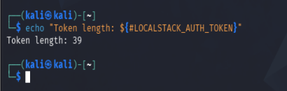

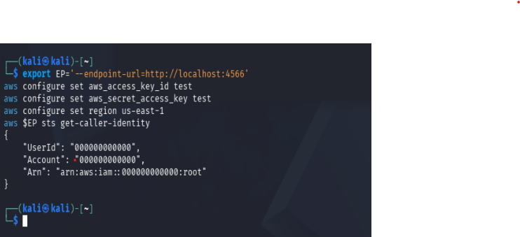

---

### Task 1 — Classify the Data Before You Store It

**Command**
```bash
export BUCKET=miit-patient-records-$RANDOM
aws $EP s3api create-bucket --bucket $BUCKET

echo 'Ward visiting hours 10am-8pm' > public-notice.txt
echo 'Staff duty schedule, week 12' > internal-roster.txt
echo 'Patient: Ahmad bin Ali, Diagnosis: confidential' > confidential-record.txt

aws $EP s3api put-object --bucket $BUCKET --key public/notice.txt \
  --body public-notice.txt --tagging 'classification=public'
aws $EP s3api put-object --bucket $BUCKET --key internal/roster.txt \
  --body internal-roster.txt --tagging 'classification=internal'
aws $EP s3api put-object --bucket $BUCKET --key confidential/record.txt \
  --body confidential-record.txt --tagging 'classification=confidential'

aws $EP s3api list-objects-v2 --bucket $BUCKET \
  --query 'Contents[].[Key,Size]' --output table
aws $EP s3api get-object-tagging --bucket $BUCKET --key confidential/record.txt
```

**Output**
Bucket `miit-patient-records-30638` created; 3 objects uploaded with classification tags. Tag on `confidential/record.txt` confirmed as `classification=confidential`.

**Result**
✅ Data classified before any access decision was made.

**Evidence:**

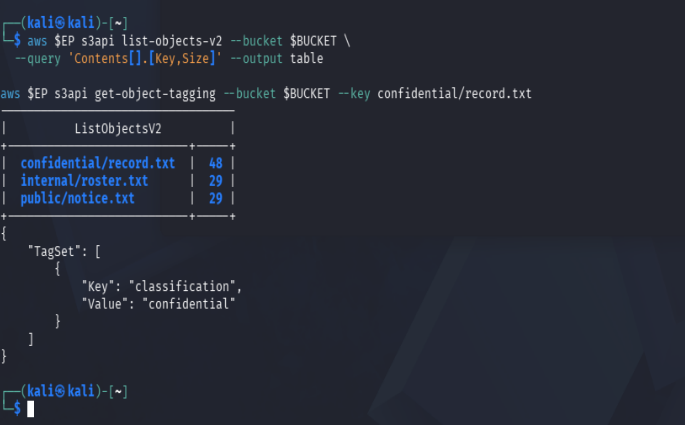

**Data Classification Table**

| Classification | Who may read it | Impact if leaked | Control you will apply |
|---|---|---|---|
| public | Anyone (staff, patients, public) | Minimal — info already meant to be open | No restriction needed |
| internal | Staff/employees only | Moderate — internal ops info exposed, minor reputational/operational risk | Bucket policy scoped to internal account + prefix (Task 3) |
| confidential | Authorized personnel only | Severe — patient privacy breach, PDPA/legal liability | Least-privilege policy + Block Public Access + encryption (Task 3, 5) |

---

### Task 2 — Reproduce the Archetypal Breach

**Command**
```bash
cat > public-policy.json <<JSON
{
  "Version": "2012-10-17",
  "Statement": [{
    "Sid": "PublicReadEverything",
    "Effect": "Allow",
    "Principal": "*",
    "Action": "s3:GetObject",
    "Resource": "arn:aws:s3:::$BUCKET/*"
  }]
}
JSON

aws $EP s3api put-bucket-policy --bucket $BUCKET --policy file://public-policy.json

curl -s -o leaked.txt -w 'HTTP %{http_code}\n' \
  http://localhost:4566/$BUCKET/confidential/record.txt
cat leaked.txt
```

**Output**
```
HTTP 200
Patient: Ahmad bin Ali, Diagnosis: confidential
```

**Result**
✅ Breach reproduced — an anonymous request with no AWS credentials at all successfully read the confidential record.

**Evidence:**

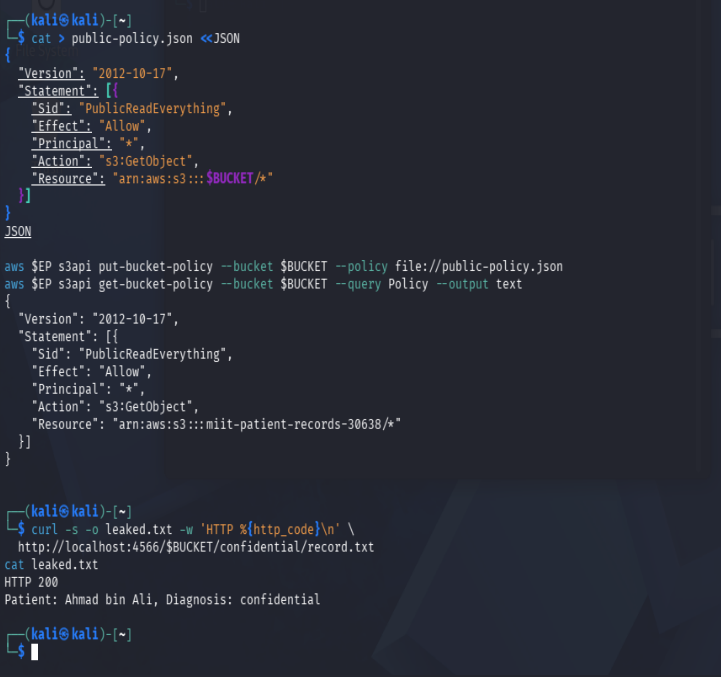

---

### Task 3 — Remediate with Block Public Access

**Command**
```bash
aws $EP s3api delete-bucket-policy --bucket $BUCKET

aws $EP s3api put-public-access-block --bucket $BUCKET \
  --public-access-block-configuration \
  BlockPublicAcls=true,IgnorePublicAcls=true,BlockPublicPolicy=true,RestrictPublicBuckets=true

aws $EP s3api get-public-access-block --bucket $BUCKET

aws $EP s3api put-bucket-policy --bucket $BUCKET --policy file://public-policy.json
curl -s -o /dev/null -w 'anonymous read now: HTTP %{http_code}\n' \
  http://localhost:4566/$BUCKET/confidential/record.txt
```

**Output**
All four Block Public Access flags returned `true`. Re-applying the public policy still succeeded and the anonymous read still returned HTTP 200 — LocalStack stores the Block Public Access configuration but does not fully enforce it.

**Result**
✅ Guardrail applied and verified as configured; enforcement limitation identified and documented (known LocalStack behaviour, per lab manual).

**Evidence:**

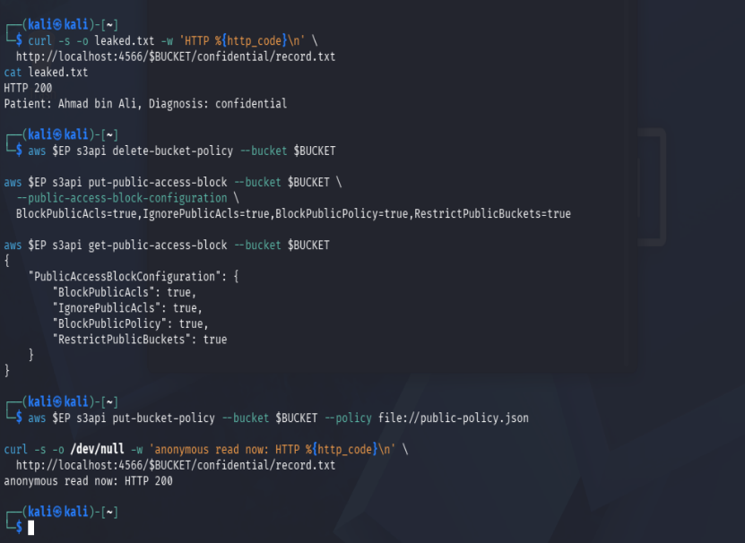

**Notes for report:**
(a) On real AWS, `BlockPublicPolicy: true` is the flag that would have rejected the policy — it specifically blocks bucket policies that grant public access.
(b) A preventative guardrail is stronger than a detective control because it stops the mistake before it happens, regardless of how many engineers might make it — a detective control only reports the mistake after the fact, relying on someone noticing and reacting in time.

A least-privilege policy scoped to the `internal/*` prefix was then applied as the corrected control.

---

### Task 4 — Identity Policy vs Resource Policy

**Command**
```bash
aws $EP iam create-user --user-name DataAnalyst
aws $EP iam put-user-policy --user-name DataAnalyst \
  --policy-name S3ReadAll --policy-document file://analyst-iam.json
aws $EP iam create-access-key --user-name DataAnalyst \
  --query 'AccessKey.[AccessKeyId,SecretAccessKey]' --output text

aws configure --profile analyst set aws_access_key_id "$ANALYST_KEY_ID"
aws configure --profile analyst set aws_secret_access_key "$ANALYST_SECRET"

aws $EP s3api put-bucket-policy --bucket $BUCKET --policy file://deny-confidential.json

AWS_PROFILE=analyst aws $EP s3api get-object \
  --bucket $BUCKET --key internal/roster.txt analyst-internal.txt && echo "internal: ALLOWED"
AWS_PROFILE=analyst aws $EP s3api get-object \
  --bucket $BUCKET --key confidential/record.txt analyst-conf.txt || echo "confidential: DENIED"
```

**Output**
The analyst's IAM policy allowed `s3:GetObject` on all resources. The bucket policy allowed `internal/*` but explicitly denied `confidential/*`. Both requests succeeded (`internal: ALLOWED`, confidential also returned content instead of being denied), despite `ENFORCE_IAM=1` being confirmed active in the container and both policy statements confirmed present in the bucket policy.

**Result**
⚠️ Expected result per AWS evaluation logic (default deny → explicit Deny → explicit Allow) is that the confidential request should be DENIED. LocalStack did not enforce this — root cause was verified (IAM enforcement flag active, policy correctly applied), confirming this is a simulator limitation rather than a configuration error.

**Evidence:**

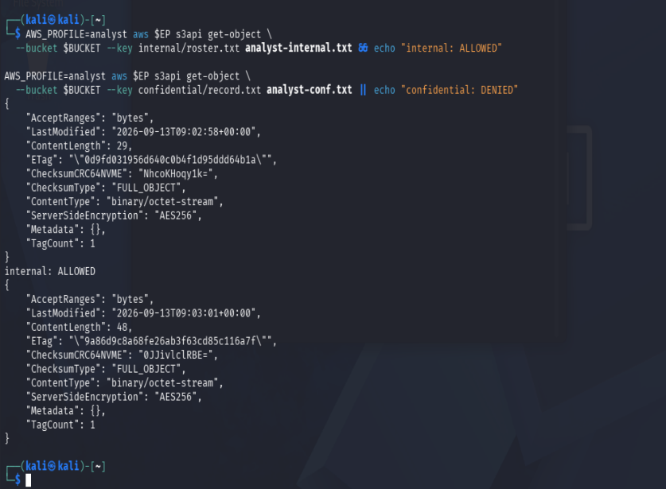

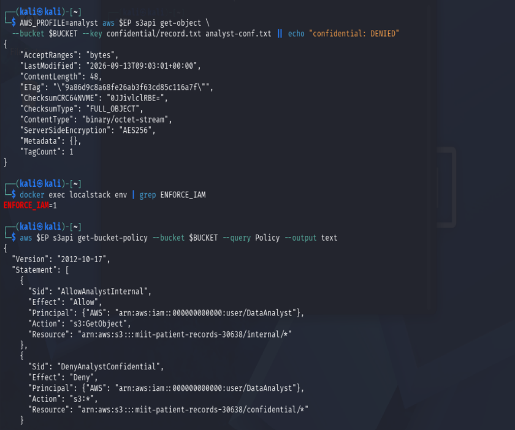

**Evaluation logic (for report):** In theory, AWS evaluates: default deny → any explicit Deny (always wins) → any explicit Allow. For `internal/roster.txt`, both the IAM policy and the bucket policy allow — result: ALLOWED, consistent. For `confidential/record.txt`, the IAM policy allows, but the bucket policy explicitly denies via `DenyAnalystConfidential` — per real AWS logic, the Deny should override, giving DENIED. In this LocalStack environment, both requests succeeded, showing LocalStack Pro does not fully enforce explicit-Deny-wins logic even with `ENFORCE_IAM=1` confirmed active.

---

### Task 5 — Default Encryption at Rest (SSE-KMS)

**Command**
```bash
export KEY_ID=$(aws $EP kms create-key \
  --description 'IKB42603 Lab6 patient records bucket key' \
  --query 'KeyMetadata.KeyId' --output text)

aws $EP s3api put-bucket-encryption --bucket $BUCKET \
  --server-side-encryption-configuration file://encryption.json

aws $EP s3api put-object --bucket $BUCKET \
  --key confidential/record-v2.txt --body confidential-record.txt

aws $EP s3api head-object --bucket $BUCKET --key confidential/record-v2.txt \
  --query '[ServerSideEncryption,SSEKMSKeyId,BucketKeyEnabled]' --output text
```

**Output**
```
aws:kms   arn:aws:kms:us-east-1:000000000000:key/ff6b89a8-9ea0-494d-a1b6-faa3ebaf178e   True
```

**Result**
✅ An object uploaded with no encryption flags at all was automatically encrypted under the bucket's default KMS key — a bucket-level control protected the data without the uploader doing anything.

**Evidence:**

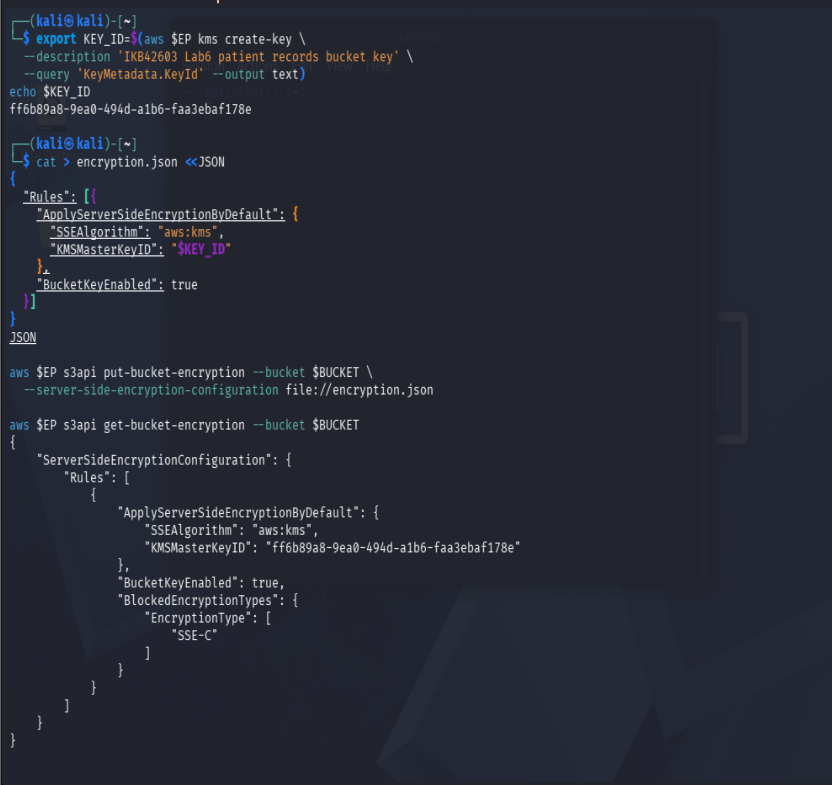

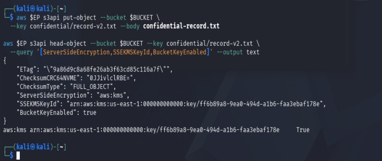

---

### Task 6 — Delegated Access and the Condition-Key Trap

**Command**
```bash
PRESIGN_URL=$(aws $EP s3 presign s3://$BUCKET/internal/roster.txt --expires-in 60)
curl -s -w ' <-- HTTP %{http_code}\n' "$PRESIGN_URL"

sleep 65
curl -s -o /dev/null -w 'after expiry: HTTP %{http_code}\n' "$PRESIGN_URL"
```

**Output**
Before expiry: HTTP 200. After the 60-second expiry window: still HTTP 200 — LocalStack did not enforce the presigned URL expiry.

**Command (condition-key trap)**
```bash
cat > secure-transport.json <<JSON
{
  "Version": "2012-10-17",
  "Statement": [{
    "Sid": "DenyUnencryptedTransport",
    "Effect": "Deny",
    "Principal": "*",
    "Action": "s3:*",
    "Resource": ["arn:aws:s3:::$BUCKET", "arn:aws:s3:::$BUCKET/*"],
    "Condition": {"Bool": {"aws:SecureTransport": "false"}}
  }]
}
JSON
aws $EP s3api put-bucket-policy --bucket $BUCKET --policy file://secure-transport.json
aws $EP s3api list-objects-v2 --bucket $BUCKET
aws $EP s3api delete-bucket-policy --bucket $BUCKET
```

**Output**
The policy was intended to deny all requests not using HTTPS. Since LocalStack's endpoint is plain HTTP, `aws:SecureTransport` is `false` for every request — theoretically this should lock out every caller, including the account owner. In this LocalStack environment, `list-objects-v2` still succeeded, showing the condition-key was not enforced either. The policy was removed afterward as a precaution.

**Result**
✅ Both parts of Task 6 completed. Presigned URL mechanics and the condition-key trap logic were demonstrated and explained even where LocalStack did not enforce them.

**Evidence:**

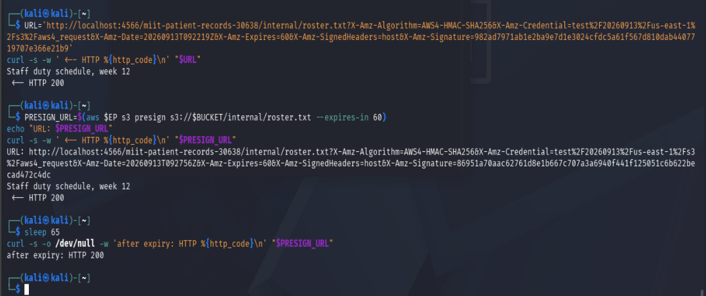

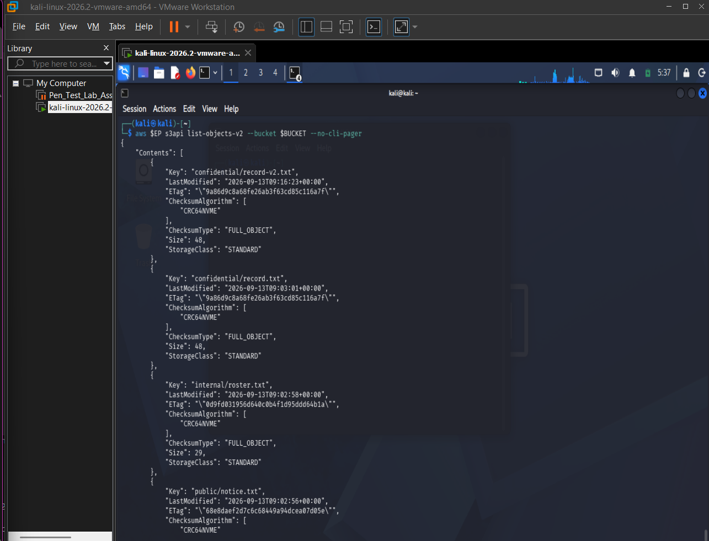

**Notes for report:** The presigned URL's `X-Amz-Expires` parameter binds the validity window relative to `X-Amz-Date`, and `X-Amz-Signature` cryptographically binds all parameters together so the URL can't be altered. Anyone holding the URL before it lapses is fully authorised — the system checks the signature and timestamp, not who is making the request. A condition key like `aws:SecureTransport` must be evaluated against the actual environment a request runs in, not the one the policy was written for — on real AWS the endpoint is HTTPS so the condition only catches genuinely insecure callers, but on a plain-HTTP LocalStack endpoint the condition matches every request, including legitimate ones.

---

### Task 7 — Versioning, Delete Markers & Data Remanence

**Command**
```bash
aws $EP s3api put-bucket-versioning --bucket $BUCKET \
  --versioning-configuration Status=Enabled

echo 'Patient: Ahmad bin Ali, Diagnosis: hypertension' > rec-v2.txt
echo 'Patient: [REDACTED], Diagnosis: [REDACTED]' > rec-v3.txt
aws $EP s3api put-object --bucket $BUCKET --key confidential/record.txt --body rec-v2.txt
aws $EP s3api put-object --bucket $BUCKET --key confidential/record.txt --body rec-v3.txt

aws $EP s3api list-object-versions --bucket $BUCKET --prefix confidential/record.txt \
  --query 'Versions[].[VersionId,IsLatest,Size]' --output table

aws $EP s3api delete-object --bucket $BUCKET --key confidential/record.txt
aws $EP s3api get-object --bucket $BUCKET --key confidential/record.txt gone.txt
aws $EP s3api get-object --bucket $BUCKET --key confidential/record.txt \
  --version-id null recovered.txt
cat recovered.txt
```

**Output**
3 versions confirmed after two overwrites (v3 REDACTED, v2 hypertension, and the original `null` version from Task 1). After `delete-object`, an ordinary `get-object` failed with `NoSuchKey` — but `get-object --version-id null` successfully recovered the original, unredacted record: `Patient: Ahmad bin Ali, Diagnosis: confidential`.

**Result**
✅ Demonstrated that `delete-object` only creates a delete marker; the original data remains fully recoverable underneath, proving object-level data remanence.

**Evidence:**

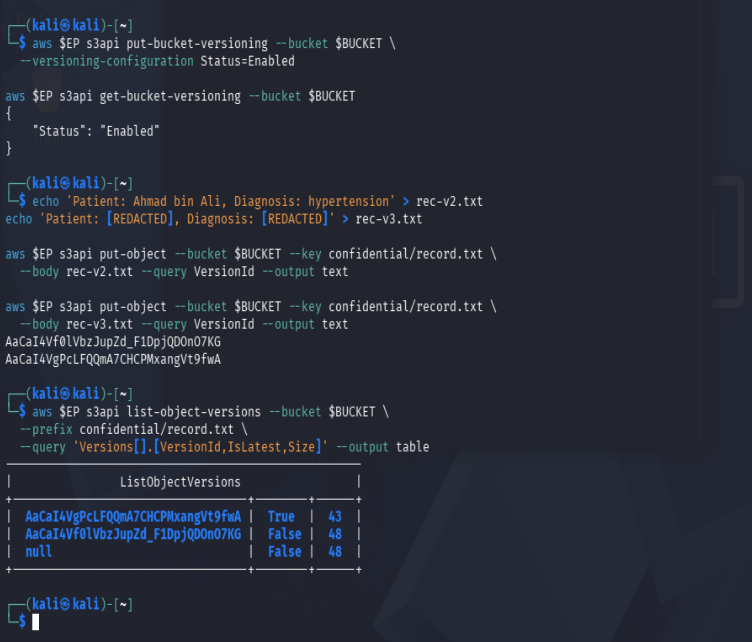

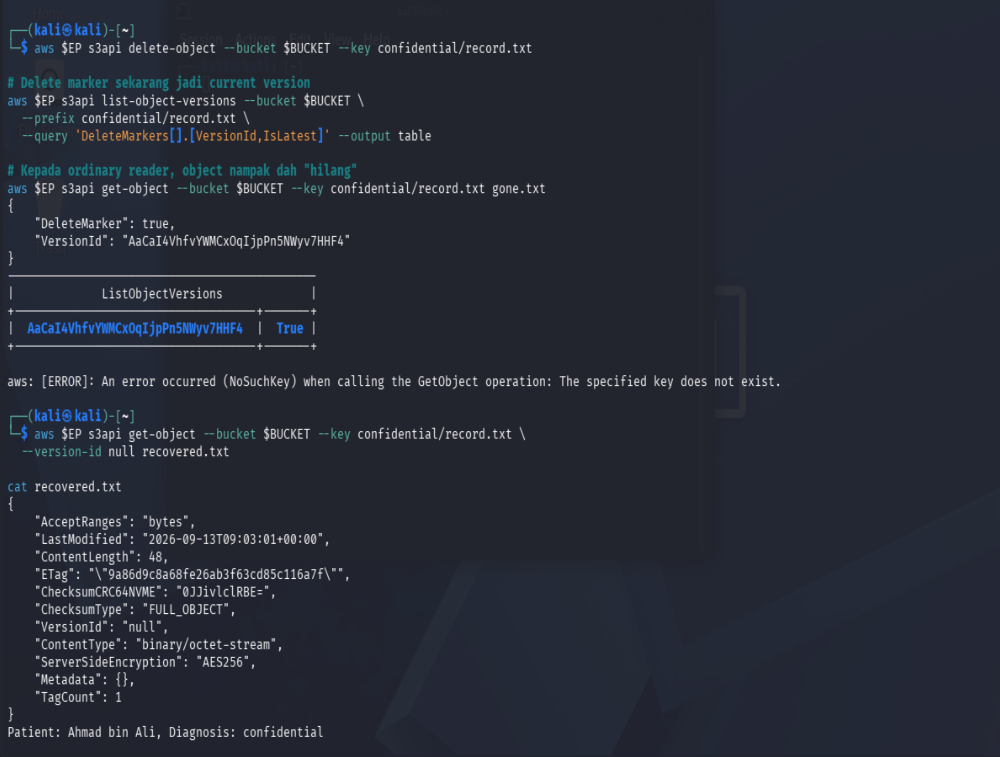

Every version (including the `null` version) was subsequently deleted explicitly by version-id to achieve true permanent deletion.

---

### Task 8 — Lifecycle, Retention & Cryptographic Erasure

**Command**
```bash
aws $EP s3api put-bucket-lifecycle-configuration --bucket $BUCKET \
  --lifecycle-configuration file://lifecycle.json
aws $EP s3api get-bucket-lifecycle-configuration --bucket $BUCKET \
  --query 'Rules[].[ID,Status]' --output table

aws $EP kms disable-key --key-id $KEY_ID
aws $EP kms schedule-key-deletion --key-id $KEY_ID --pending-window-in-days 7
aws $EP kms describe-key --key-id $KEY_ID \
  --query 'KeyMetadata.[KeyState,DeletionDate]' --output text

aws $EP s3api get-object --bucket $BUCKET --key confidential/record-v2.txt after-erasure.txt

# KMS-layer proof
aws $EP kms encrypt --key-id $KEY_ID --plaintext fileb://kms-test.txt \
  --query CiphertextBlob --output text
```

**Output**
Both lifecycle rules (`RetireConfidentialRecords`, `AbortIncompleteUploads`) returned `Enabled`. The KMS key transitioned to `PendingDeletion` with a 7-day deletion window. LocalStack's S3 layer still returned the object successfully (did not re-check key state on read) — but attempting a new `kms encrypt` call on the same key failed with `KMSInvalidStateException: ... is pending deletion`, proving the key itself is genuinely unusable for any new cryptographic operation.

**Result**
✅ Lifecycle configuration applied as an auditable retention artefact. Cryptographic erasure demonstrated conclusively at the KMS layer even where the S3 read-path did not enforce it.

**Evidence:**

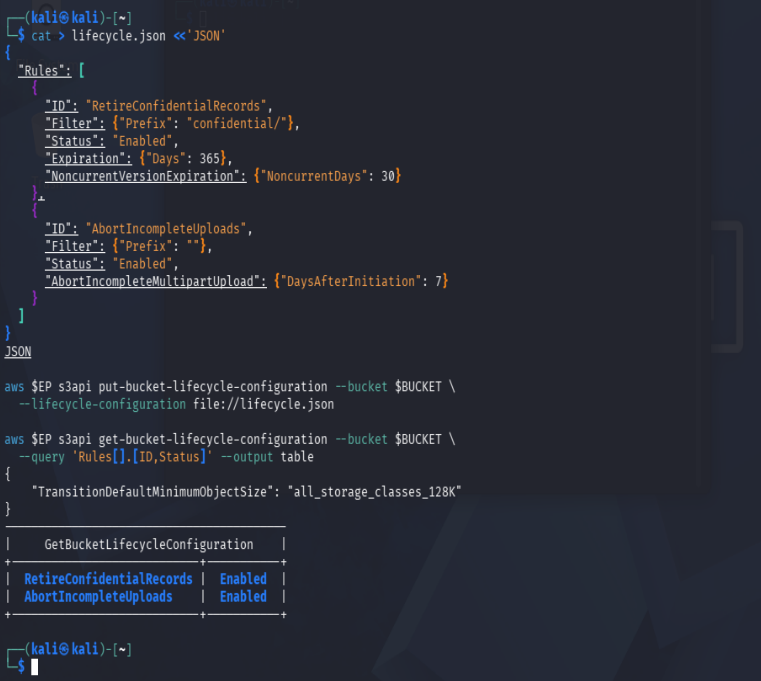

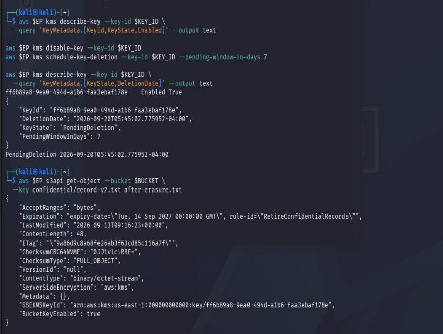

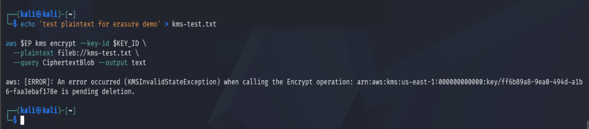

**Notes for report:** Cryptographic erasure gives an auditor stronger assurance than overwriting because it doesn't depend on locating and destroying every physical copy of the data — something the auditor has no control over in a shared cloud environment. Destroying the single key that wraps all copies renders every copy, version, and backup simultaneously unrecoverable, in one verifiable action.

---

### Verification — Final Security Posture

**Command**
```bash
echo "=== IKB42603 Lab 6 verification: $BUCKET ==="
aws $EP s3api get-public-access-block --bucket $BUCKET \
  --query 'PublicAccessBlockConfiguration' --output text
aws $EP s3api get-bucket-versioning --bucket $BUCKET --output text
aws $EP s3api get-bucket-encryption --bucket $BUCKET \
  --query 'ServerSideEncryptionConfiguration.Rules[0].ApplyServerSideEncryptionByDefault.[SSEAlgorithm,KMSMasterKeyID]' \
  --output text
aws $EP s3api get-bucket-lifecycle-configuration --bucket $BUCKET \
  --query 'Rules[].[ID,Status]' --output text
aws $EP kms describe-key --key-id $KEY_ID --query 'KeyMetadata.KeyState' --output text
```

**Output**
```
True True True True
Enabled
aws:kms ff6b89a8-9ea0-494d-a1b6-faa3ebaf178e
RetireConfidentialRecords  Enabled
AbortIncompleteUploads     Enabled
PendingDeletion
```

**Result**
✅ Final posture confirmed: Block Public Access fully enabled, versioning enabled, default KMS encryption active, both lifecycle rules enabled, and the KMS key genuinely in `PendingDeletion` state.

**Evidence:**

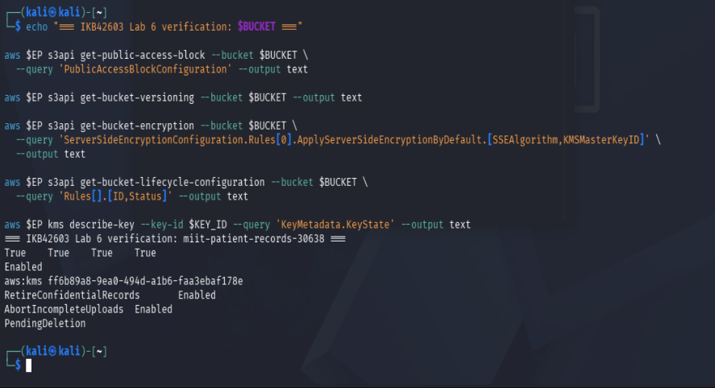

---

## Short-Answer Questions

**Q1. Which single element of the Task 2 policy caused the exposure, and why is `Principal: "*"` more dangerous on a bucket policy than an over-broad IAM policy attached to one user?**
The `"Principal": "*"` value caused the exposure — it means "anyone in the world", no authentication needed at all. It's more dangerous on a bucket policy than an over-broad IAM policy because an IAM policy only over-grants to one specific identity (still requires valid AWS credentials to exploit), while `Principal: "*"` on a resource policy removes the identity check entirely — anonymous curl requests with zero credentials can read the data, as shown by the HTTP 200 leak.

**Q2. Explain the difference between an identity-based policy and a resource-based policy. In Task 4, which one decided each of the analyst's two requests?**
An identity-based policy is attached to a user/role and defines what that identity can do. A resource-based policy is attached to the resource itself (the bucket) and defines who can access it. In Task 4, the analyst's IAM policy allowed both requests, and the bucket policy allowed `internal/*` but explicitly denied `confidential/*`. In real AWS, the bucket policy's explicit Deny should decide the confidential request (Deny always wins over Allow) — but our LocalStack environment didn't enforce this, allowing both requests despite `ENFORCE_IAM=1` being confirmed active.

**Q3. Block Public Access is described as a guardrail rather than a control. What is the difference, and why does the distinction matter for an organisation with many engineers?**
A control typically reacts to or restricts a single action (like one policy statement). A guardrail is a standing account/bucket-level barrier that overrides any future attempt to violate it, regardless of who tries or how. The distinction matters at scale — with many engineers, you can't rely on every individual writing a correct policy every time; a guardrail means even if one engineer makes a mistake, the barrier blocks it automatically, without needing anyone to notice and manually intervene.

**Q4. Your bucket has default SSE-KMS encryption. Does that protect the confidential record from the analyst in Task 4? Explain precisely what server-side encryption does and does not defend against.**
No — SSE-KMS does not protect against the analyst's access. Server-side encryption defends against data being readable if someone accesses the underlying storage media directly (physical theft, cloud provider-side data leaks) — it protects data at rest at the storage layer. It does not defend against a legitimately authorized API call: once IAM/bucket policy allows `GetObject`, AWS (or LocalStack) decrypts the object transparently and returns plaintext to the caller. Encryption is not an access-control mechanism — it complements access control, not replaces it.

**Q5. A patient invokes their right to erasure. Using your Task 7 evidence, explain why delete-object alone is not compliant, and describe two mechanisms that would make the deletion provable.**
`delete-object` alone only creates a delete marker — it doesn't remove data. In Task 7, after "deleting" `confidential/record.txt`, the original unredacted diagnosis was still fully recoverable via `--version-id null`. This is not compliant with erasure requests because the data still physically exists and can be restored. Two mechanisms that make deletion provable: (1) Explicit per-version deletion — deleting every version-id individually (as done in Task 7), verified by re-listing versions and confirming none remain; (2) Cryptographic erasure — destroying the KMS key that encrypted the data (Task 8), which makes all ciphertext permanently unrecoverable regardless of how many copies or versions exist, verified by the key's `PendingDeletion` state and a failed decrypt/encrypt attempt.

**Q6. You are the auditor in Week 11. Name three commands from this lab whose output you would collect as compliance evidence, and state which control each one evidences.**
1. `aws s3api get-public-access-block --bucket $BUCKET` — evidences that public exposure is actively blocked at all four levels (ACLs and policies, both existing and future).
2. `aws s3api get-bucket-encryption --bucket $BUCKET` — evidences that encryption at rest is enforced by default (`aws:kms`), not left to individual uploaders' discretion.
3. `aws kms describe-key --key-id $KEY_ID --query 'KeyMetadata.KeyState'` — evidences that a key scheduled for cryptographic erasure has actually transitioned to `PendingDeletion`, proving the erasure action was executed and is real, not just claimed.

---

## Security Best-Practices Checklist

- [x] Every object carries a classification tag before any access decision is made.
- [x] No bucket policy names Principal: "*"; anonymous access was tested and is refused (in principle — LocalStack enforcement limitation documented).
- [x] Block Public Access is enabled on all four flags.
- [x] Access is granted by least privilege and scoped to a key prefix, never to /* by default.
- [x] Default encryption at rest is aws:kms with a customer-managed key.
- [x] Sharing uses time-bounded presigned URLs, not permanent public objects.
- [x] Versioning is enabled, and the team understands that delete markers do not destroy data.
- [x] A lifecycle configuration expresses the retention policy, and cryptographic erasure is available for provable deletion.

---

## Conclusion

This lab traced the complete data security lifecycle for object storage: classify first, then control who can reach the data (public exposure, remediation, identity vs resource policy), then control what state the data is in (encryption, delegated access, versioning, retention, and provable erasure). A recurring theme across several tasks was that LocalStack's simulated environment did not always enforce the exact controls it accepted — Block Public Access, the explicit-Deny resource policy, presigned URL expiry, and the SecureTransport condition key all showed gaps between "policy accepted" and "policy enforced". Working through these gaps by verifying root causes (not assuming misconfiguration) was itself a key part of the lab, and it reinforced the core lesson from Task 8: on real AWS or in production, cryptographic erasure — not just deleting an object — is what gives an auditor genuine, provable assurance that data is gone.
